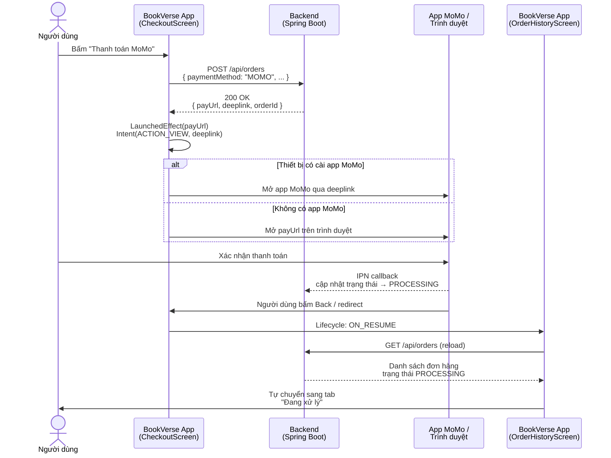

```mermaid
sequenceDiagram
    actor User as Người dùng
    participant App as BookVerse App<br/>(CheckoutScreen)
    participant BE as Backend<br/>(Spring Boot)
    participant MoMo as App MoMo /<br/>Trình duyệt
    participant Order as BookVerse App<br/>(OrderHistoryScreen)

    User->>App: Bấm "Thanh toán MoMo"
    App->>BE: POST /api/orders<br/>{ paymentMethod: "MOMO", ... }
    BE-->>App: 200 OK<br/>{ payUrl, deeplink, orderId }

    App->>App: LaunchedEffect(payUrl)<br/>Intent(ACTION_VIEW, deeplink)

    alt Thiết bị có cài app MoMo
        App->>MoMo: Mở app MoMo qua deeplink
    else Không có app MoMo
        App->>MoMo: Mở payUrl trên trình duyệt
    end

    User->>MoMo: Xác nhận thanh toán
    MoMo-->>BE: IPN callback<br/>cập nhật trạng thái → PROCESSING
    MoMo->>App: Người dùng bấm Back / redirect

    App->>Order: Lifecycle: ON_RESUME
    Order->>BE: GET /api/orders (reload)
    BE-->>Order: Danh sách đơn hàng<br/>trạng thái PROCESSING
    Order->>User: Tự chuyển sang tab<br/>"Đang xử lý"
```

